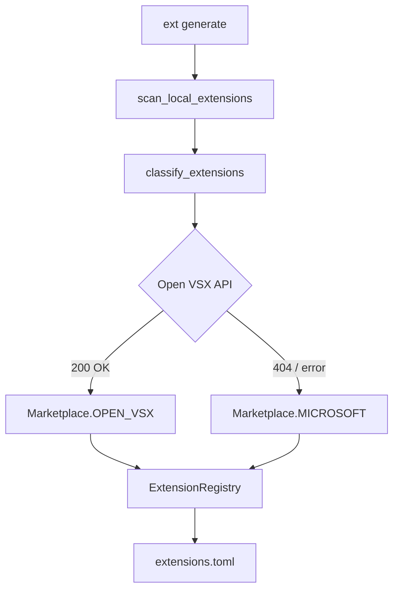
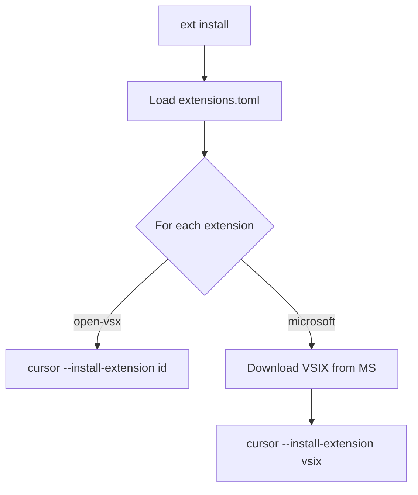

# Architecture

## `ext generate` flow

```mermaid
flowchart TD
    A[ext generate] --> B[scan_local_extensions]
    B --> C[classify_extensions]
    C --> D{Open VSX API}
    D -->|200 OK| E[Marketplace.OPEN_VSX]
    D -->|404 / error| F[Marketplace.MICROSOFT]
    E --> G[ExtensionRegistry]
    F --> G
    G --> H[extensions.toml]
```

## `ext install` flow

```mermaid
flowchart TD
    A[ext install] --> B[Load extensions.toml]
    B --> C{For each extension}
    C -->|open-vsx| D[cursor --install-extension id]
    C -->|microsoft| E[Download VSIX from MS]
    E --> F[cursor --install-extension vsix]
```
